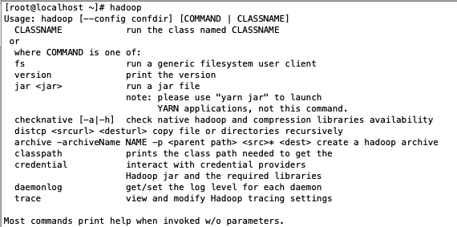

### hadoop 单机环境搭建

1. 下载 hadoop 安装包
   可以到附近的镜像进行下载，镜像站点可以在下面的网址查到
   https://www.apache.org/dyn/closer.cgi/hadoop/common

2. 使用 wget 命令下载安装包,这里以 2.7.7 版本为例

```
wget https://mirrors.tuna.tsinghua.edu.cn/apache/hadoop/common/hadoop-2.7.7/hadoop-2.7.7.tar.gz
```

3. 使用 tar 命令解压安装包

```
tar -zxvf hadoop-2.7.7.tar.gz
```

4. 修改配置中`JAVA_HOME`

```
vim etc/hadoop/hadoop-env.sh
```

找到`JAVA_HOME`配置并修改

5. 配置`HADOOP_HOME`

```
vim /etc/profile
```

增加如下两行

```
HADOOP_HOME=hadoop解压路径
PATH=$PATH:$HADOOP_HOME/bin
```

最后再`source`一下配置文件

```
source /etc/profile
```

6.输入 hadoop，见到如下截图则说明安装成功了

